# WFI32 Layer 2 Transparent Bridge between Ethernet and Wifi in AP Mode 
_25th August 2023 - martin.ruppert@microchip.com - ESE/Microchip_

The intention of this demo is to show how create a transparent bridge   between the the ethernet and wifi interface. The demo is acting as a Access Point with a shared maximum bandwidth of 20Mbit/sec and 8 clients.  
All IP frames are transparently forwarded between the two interfaces.  

### Abbreviations:
AP = Access Point 
STA = Station (Wlan client) 
example: "an STA connects to an AP" 
 

### PIC32 WFI32E Curiosity Board: Part Number: EV12F11A 
https://www.microchip.com/en-us/development-tool/ev12f11a
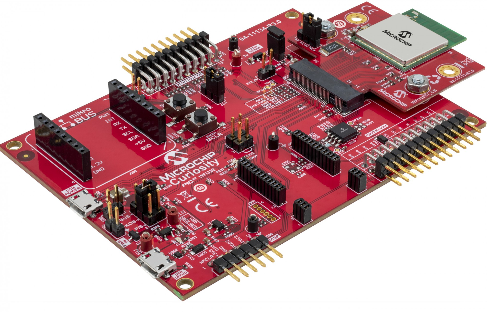
 

### LAN8720A PHY Daughter Board: Part Number: AC320004-3 
https://www.microchip.com/en-us/development-tool/AC320004-3
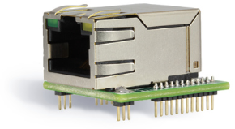 
but could be also onw of these 
<table>
<tr><td> AC320004-2 </td><td> IC PLUS IP101G </td></tr>
<tr><td> AC320004-3 </td><td> LAN8720A </td></tr>
<tr><td> AC320004-4 </td><td> LAN9303 (3 Port Switch)  </td></tr>
<tr><td> AC320004-5 </td><td> KSZ8041 </td></tr>
<tr><td> AC320004-6 </td><td> KSZ8061 </td></tr>
<tr><td> AC320004-7 </td><td> KSZ8863 </td></tr>
</table> 

### The necessary tools: 
<ul>
<li>MPLABX v6.15</li>
<li>XC32 v3.01</li>
<li>MHC v3.8.5 (Standalone)</li>
<li>Contenmanager v1.7.1 (Standalone)</li>
<li>Java Runtime Enviroment</li>
<li>Terraterm</li>
</ul>
<table> 

### The used Harmony Repository Versions:
<tr><td>v3.11.1</td><td>core</td></tr>
<tr><td>v3.16.0</td><td>csp</td></tr>
  <tr><td> v3.8.0 </td><td> wireless_wifi </td></tr>
  <tr><td> v3.9.0 </td><td> usb </td></tr>
  <tr><td> v3.13.1 </td><td> dev_packs </td></tr>
  <tr><td> v3.7.0 </td><td> wireless_system_pic32mzw1_wfi32e01 </td></tr>
  <tr><td> v5.4.0 </td><td> wolfssl </td></tr>
  <tr><td> v3.8.0 </td><td> net </td></tr>
  <tr><td> v3.7.6 </td><td> crypto </td></tr>
  <tr><td> v10.4.6 </td><td> CMSIS-FreeRTOS </td></tr>
</table> 

## How To build, maintain and use the Demo

1. Create a working directory somewhere with any name and switch into it. Clone the following repository wich contains batch jobs which then clone everything else for the projec</li>

        git clone https://github.com/zabooh/scripts_bridge

2. Then switch to the "scripts_bridge" folder and run the script

        git_clone_bridge.bat 

3. Then with MPLABX v6.15 open the project in the following folder

        ..\apps\apps\wfi32_bridge\firmware\pic32mz_w1_curiosity_freertos.X

4. Build with the XC32 v3.01

5. Populate a WFI32 Curiosity Board with an Ethernet Daughter Board (LAN8740) and connect it to an Ethernet port of a switch that is connected to a router (with DHCP).

6. Plug in the USB port of the WFI32 (this is the one in the middle)

7. Put the jumper J202 near the socket on "VBUS-PKOB".

8. Plug in the USB of the onboard debugger, select and program in the MPLABX
The two jumpers of the J301 must be plugged in for this.  
These lines are ICSPDAT and ICSPCLK from the debugger to the target 
Programming takes about 1 minute 43 seconds for about 600kB

9. Using an external debugger instead (I use the SNAP),
Jumper J301 must be pulled 
The SNAP takes only 15 seconds with the setting "Program Speed: High"

10. When the firmware starts, a virtual COM port opens. This COM port is created by the CDC driver in the firmware. Therefore, no UART needs to be connected. 
Open this COM port with Terraterm. 
After pressing the "Reset" button, you should see the following:
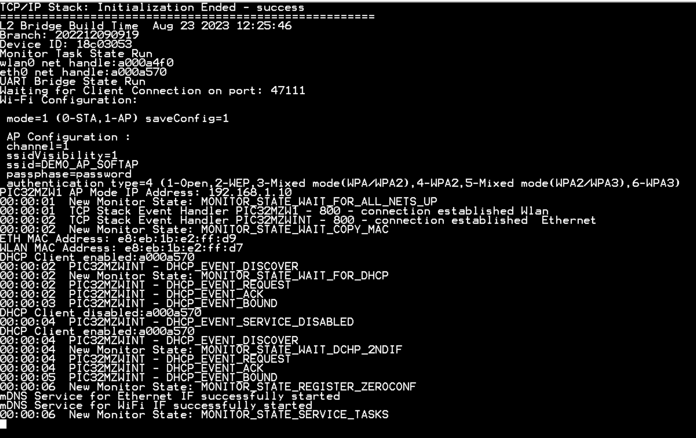    

11. An access point with the name "DEMO_AP_SOFTAP" becomes visible. He has the password "password" 
If an STA (“station”, e.g. a smart phone) connects to the AP (access point), the message appears:
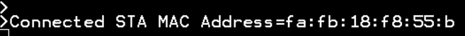
All IP packets are forwarded from the STA to the Ethernet switch and all packets from the switch back to the STA. 
This creates a "transparent layer 2 bridge". The switch sees an Ethernet client and no Wifi STA. 
As a result, the STA's DHCP client request is forwarded to the Ethernet switch and a DHCP server visible there will then assign an IP to the client. 
If the STA then books itself out again 
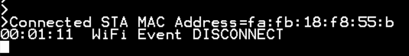

12. If the Ethernet cable is removed, the firmware restarts

13. When the cable is plugged into a PC, the firmware waits 5 seconds for a response from a DHCP server. 
Since this does not come with a PC, the firmware switches on its own DHCP server and assigns the PC an IP address 
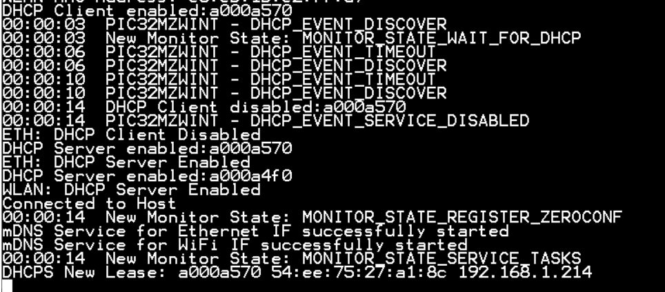
A STA that registers with the AP then gets an IP with the same network mask, so that the PC and the STA can "see" each other
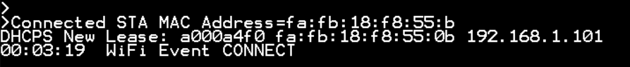
If the STA-AP connection is interrupted because the STA (smartphone) thinks, for example, that it cannot reach the Internet, then everything starts again automatically until the connection remains stable. 
The restart occurs so quickly that the STAs try to negotiate the connection again independently because the AP requests them to do so. Then the session keys of the WPA encryption are regenerated. All of this happens so quickly that the user doesn't notice anything. 
So it is not a problem if the firmware reboots during a SoftAP connection to an STA. 

14. Restarting the firmware on interruptions allows the connections to be dynamically changed without user interaction on the device. It has proven to be problematic to reestablish the STA connections at runtime, especially in connection with iPhones. 
On the command line there are some commands
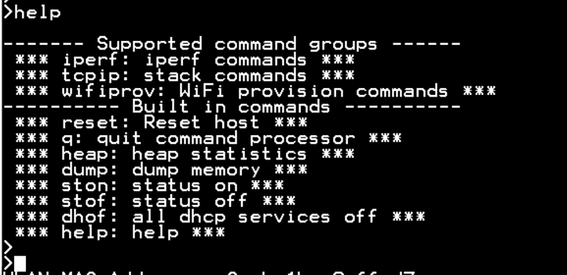

        reset
    Setzt die Firmware zurück

        heap
    Zeigt die Heap Ausladtung an. Es wird der FreeRTOS Heap verwendet, da dieser Diagnose Funktionen beinhaltet im gegensatz zum Heap Managment der C Runtime Library
        
        dump
    Listet Speicher Inhalte auf
    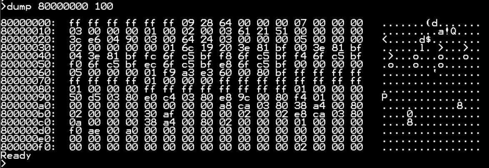

        ston 
    Switches on a status display that is refreshed once per second in the top two lines
    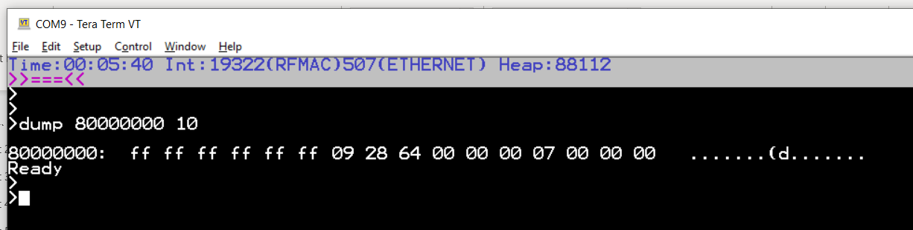

        stof
    Switches the status display off again

        dhof
    Ends all DHCP functions (client and, if applicable, server)

15. The MHC is still used for configuration. This is available as a separate executable file in the framework: 

        \frameworks\app\mhc\runmhc.bat
    The configuration of the project is loaded there 
        
        \apps\apps\wfi32_bridge\firmware\src\config\pic32mz_w1_eth_wifi_freertos\
    And all code can be regenerated. 
    This allows the MHC to be used to add, remove or re-parameterize other components

16. In the project directory there is a batch job 

        pic32mz_w1_curiosity_freertos.X\create_listing_release.bat
    that creates a complete disassambling listing filer from the generated ELF file 
    
        pic32mz_w1_curiosity_freertos.X.production.disassembly.txt
    and a listing of all symbols sorted by memory address

        "pic32mz_w1_curiosity_freertos.X.production.symbols.txt"
    The tool "cmsort.exe" is used for this, which is also checked in in the repo. 
    If an exception occurs, the CPU registers are dumped in a RAM memory area that is not initialized when the firmware is restarted. That is, if the exception occurs and the firmware restarts, a register dumb is issued when restarting. 
    With the help of the erroneous command 
    
        dump 0 1
    (an attempt is made to read from an address 0 that does not exist), an exception can be provoked.
    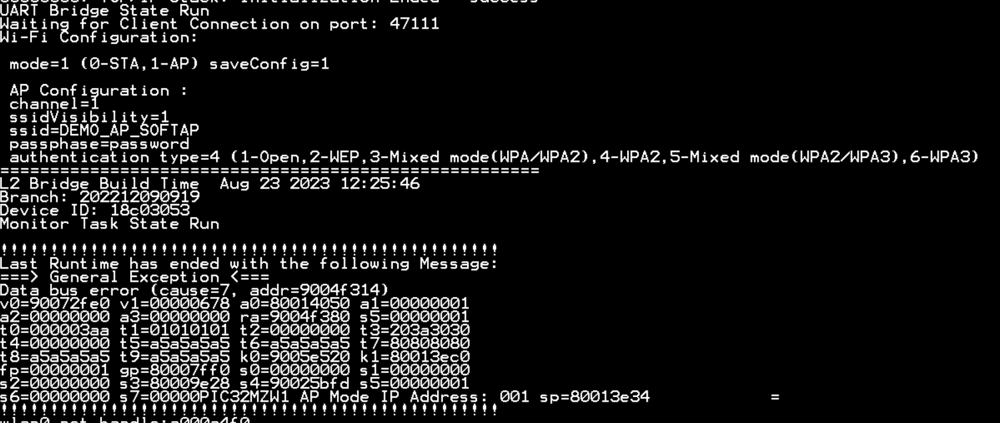
    The exception occurred at the address "addr=9004f314". 
    According to the disassembly file, the address is in the function 
    
        static void CommandDump(SYS_CMD_DEVICE_NODE* pCmdIO, int argc, char** argv) {
    in the line:
    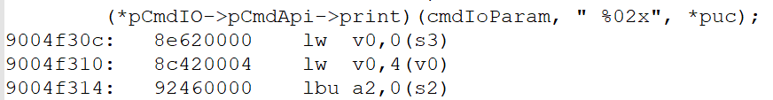
    This allows errors in firmware to be analyzed without a debugger.

17. The firmware also has a TCP - UART bridge. 
A server can be reached under TCP port **47111**, which directs all incoming data to the UART and outputs the data received on the UART via the server service. 
This can be tested with "telnet" from a host:
    telnet 192.168.0.11 at the TCP port **47111**

18. The Telnet Service is aktive as well

19. Zerconf is active on both interfaces 

